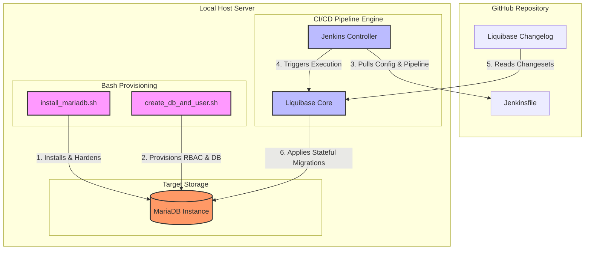

# Automated DataOps Pipeline: MariaDB Lifecycle & Jenkins-Liquibase CI/CD

A production-ready infrastructure-as-code (IaC) and DataOps project that fully automates the lifecycle of a MariaDB database server and implements an automated Database CI/CD migration pipeline using Jenkins and Liquibase.

## 🚀 Architecture Overview

This project demonstrates an end-to-end local DevSecOps loop:

1. **Host Provisioning:** Automated Bash scripts install, secure, and configure MariaDB locally.
2. **Database Provisioning:** A dedicated script initializes application-specific databases, service accounts, and granular RBAC privileges.
3. **CI/CD Orchestration:** A local Jenkins instance pulls migration blueprints dynamically from GitHub.
4. **Database Migration (Schema-as-Code):** Liquibase executes stateful changes (Drop, Create, Alter) safely against the MariaDB target.



---

## 🛠️ Project Components & Usage

### 1. Database Host Lifecycle (Bash Automation)

#### **Installation & Security Hardening**
Automates repository provisioning, package installation, service initialization, and applies production security baselines (removes anonymous users, disables remote root, purges test databases).

```bash
chmod +x install_mariadb.sh
sudo ./install_mariadb.sh
```

#### **Complete Purge / Uninstallation**
Gracefully stops database services, purges system packages, and wipes all data directories and configuration artifacts to restore a pristine host state.

```bash
chmod +x uninstall_mariadb.sh
sudo ./uninstall_mariadb.sh
```

### 2. Database Initialization Script
Configures the logical layer by creating target databases, setting up dedicated application service accounts, and granting strict Least Privilege access.

```bash
chmod +x create_db_and_user.sh
./create_db_and_user.sh
```

### 3. CI/CD Orchestration (Jenkins & Liquibase)

#### **Local Jenkins Setup**
* Jenkins controller installed locally to drive automation.
* Configured with required plugins: **Git**, **Pipeline**, and **Liquibase**.

#### **GitHub-Driven Pipeline Job**
* Created a Jenkins Pipeline job configured with **Pipeline from SCM**.
* Points to the source GitHub repository to dynamically pull the `Jenkinsfile` on execution, ensuring configuration-as-code consistency.

#### **Database Schema Migration (`Jenkinsfile` + Liquibase)**
The pipeline orchestrates stateful database migrations through sequential changestets:
* **Step 1:** Drops target table if it exists (ensures clean state execution).
* **Step 2:** Creates the target schema/table base baseline.
* **Step 3:** Performs an `ALTER` operation to add an additional column, demonstrating incremental version control for data stores.

---

## 📂 Project Structure

```text
├── scripts/
│   ├── install_mariadb.sh      # Installs & hardens MariaDB host
│   ├── uninstall_mariadb.sh    # Completely purges MariaDB package & data
│   └── create_db_and_user.sh   # Provisions database, users, and RBAC
├── db/
│   ├── changelog.xml           # Liquibase migration definitions (Drop, Create, Alter)
│   └── liquibase.properties    # Database connection and driver properties
└── Jenkinsfile                 # Declarative CI/CD pipeline definition
```

---

## 🔐 Key DataOps Concepts Demonstrated
* **Idempotency:** All Bash scripts and Liquibase changelogs can run repeatedly without breaking the system state.
* **Database Version Control:** Treats schema mutations exactly like application source code, tracking revisions transparently.
* **Configuration as Code:** Decouples pipeline logic from the Jenkins UI by tracking execution steps completely inside the repository's `Jenkinsfile`.
